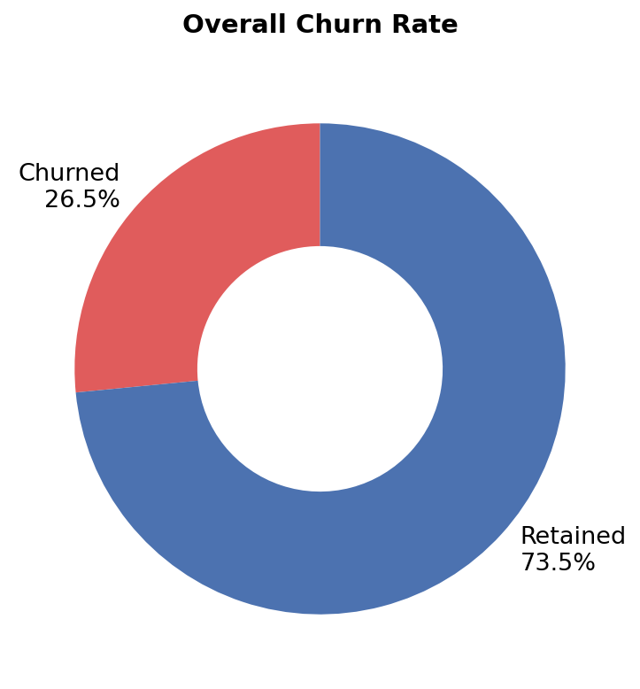
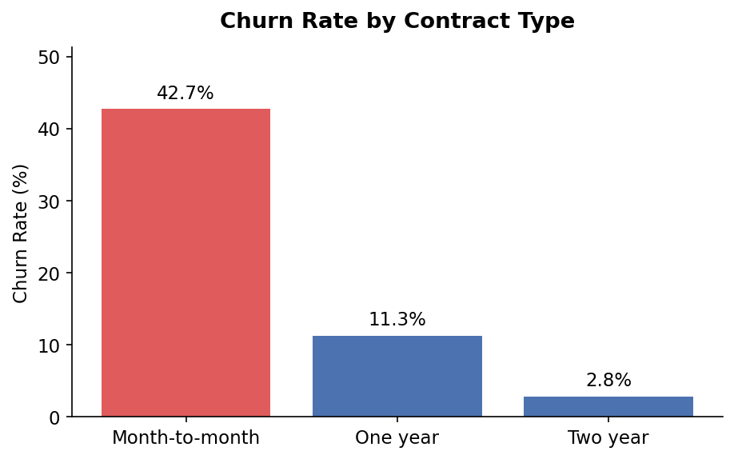
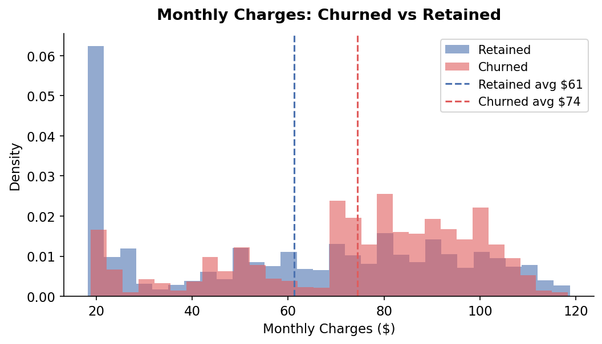
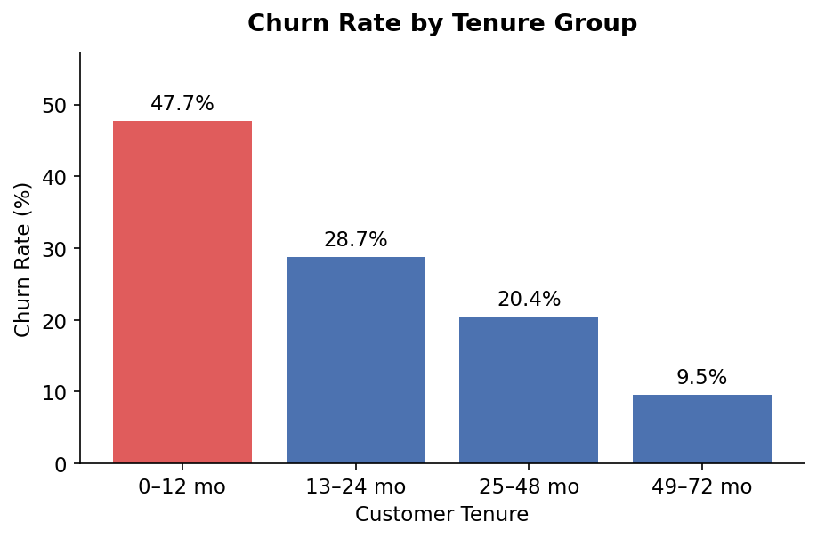
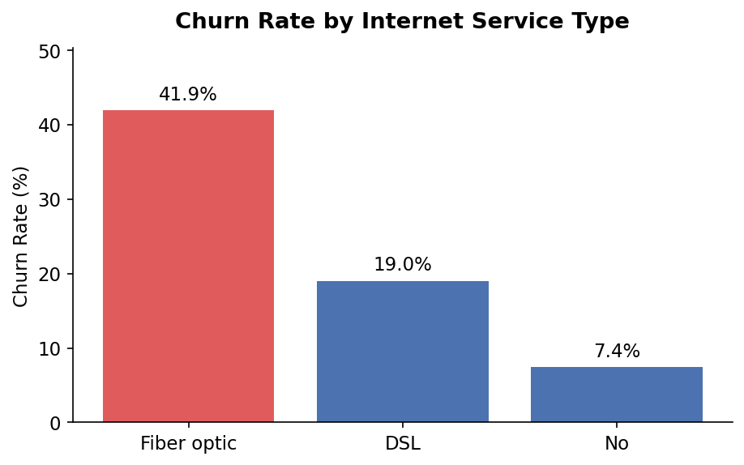

# 📉 Telco Customer Churn Analysis

An exploratory data analysis (EDA) of customer churn in a telecommunications company using Python. This project identifies the key factors that drive customers to leave and provides actionable insights for improving customer retention.

---

## 📌 Project Overview

Customer churn is one of the most costly problems in the telecom industry. This project analyzes the **Telco Customer Churn dataset** to answer key business questions:

- What is the overall churn rate?
- Which contract types have the highest churn?
- Do higher monthly charges lead to more churn?
- Are newer customers more likely to leave?
- Which internet service type sees the most churn?

---

## 📁 Repository Structure

```
telco-churn-analysis/
│
├── data/
│   └── telco_churn.csv                # Raw dataset
│
├── chart1_overall_churn.png
├── chart2_churn_by_contract.png
├── chart3_monthly_charges.png
├── chart4_churn_by_tenure.png
├── chart5_churn_by_internet.png
│
├── churn_analysis.py                  # Main analysis script
├── requirements.txt                   # Python dependencies
└── README.md
```

---

## 📊 Dataset

- **Source:** [Kaggle – Telco Customer Churn](https://www.kaggle.com/datasets/blastchar/telco-customer-churn)
- **Records:** 7,043 customers
- **Key Columns:** `Contract`, `MonthlyCharges`, `tenure`, `InternetService`, `PaymentMethod`, `Churn`

---

## 🔧 Setup & Installation

### 1. Clone the repository
```bash
git clone https://github.com/YOUR_USERNAME/telco-churn-analysis.git
cd telco-churn-analysis
```

### 2. Install dependencies
```bash
pip install -r requirements.txt
```

### 3. Add the dataset
Download `WA_Fn-UseC_-Telco-Customer-Churn.csv` from [Kaggle](https://www.kaggle.com/datasets/blastchar/telco-customer-churn), rename it to `telco_churn.csv`, and place it in the `data/` folder.

### 4. Run the analysis
```bash
python churn_analysis.py
```

---

## 📈 Key Findings

| Insight | Detail |
|---|---|
| 📊 Overall churn rate | **26.5%** of customers churned |
| 📋 Highest churn contract | **Month-to-month** — 42.7% churn rate |
| 📋 Lowest churn contract | **Two year** — only 2.8% churn rate |
| 🕐 Riskiest tenure group | **0–12 months** — 47.7% churn rate |
| 🌐 Riskiest internet type | **Fiber optic** — 41.9% churn rate |
| 💳 Riskiest payment method | **Electronic check** — 45.3% churn rate |
| 💰 Avg charges (churned) | **$74.44/month** |
| 💰 Avg charges (retained) | **$61.27/month** |

### Contract Type
Month-to-month customers churn at **42.7%** — more than 15x the rate of two-year contract customers (2.8%). Encouraging customers to commit to longer contracts is one of the most effective retention strategies.

### Monthly Charges
Churned customers pay on average **$13 more per month** than retained customers. This suggests that customers who feel they are overpaying are significantly more likely to leave.

### Tenure
Nearly **half of all customers** in their first year churn. Churn drops sharply with tenure — customers who stay beyond 4 years churn at only 9.5%. Early engagement and onboarding are critical.

### Internet Service
Fiber optic customers churn at **41.9%** despite (or possibly because of) being on a premium service. This may indicate pricing or service quality issues with the fiber product.

---

## 📉 Charts

### Overall Churn Rate


### Churn by Contract Type


### Monthly Charges: Churned vs Retained


### Churn by Tenure Group


### Churn by Internet Service


---

## 🛠 Methods

1. **Data Cleaning** — converted `TotalCharges` to numeric, handled missing values, created tenure buckets
2. **Exploratory Analysis** — grouped and aggregated churn rates by contract, tenure, internet service, and payment method
3. **Visualization** — created donut chart, bar charts, and overlapping histogram using `matplotlib`
4. **Insight Generation** — translated patterns into business recommendations for customer retention

---

## 🧰 Tech Stack

| Tool | Purpose |
|---|---|
| Python 3.x | Core language |
| pandas | Data loading, cleaning, and analysis |
| matplotlib | Data visualization |
| numpy | Numerical operations |

---

## 📄 License

This project is open source and available under the [MIT License](LICENSE).

---

## 🙋 Author

Made with Python and a passion for reducing churn. Feel free to fork, star ⭐, or open an issue!
